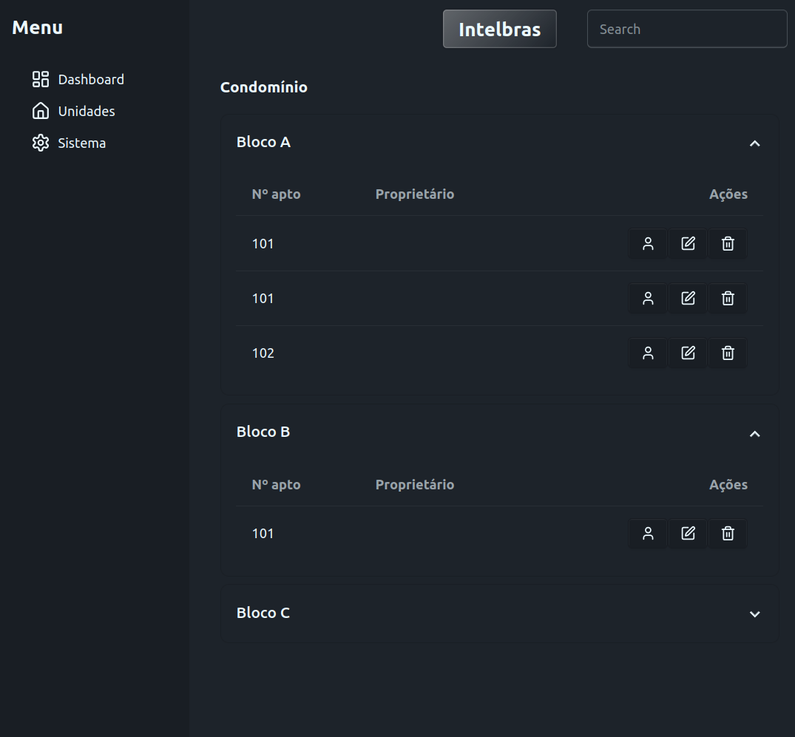

# Apartment CRUD

## Overview
MyCRUD is a React-based application designed to manage condominium data, such as blocks and apartments. The application implements authentication functionality to securely access and manipulate resources via an API.

## Features
- **Authentication:** Login functionality using a username and password, retrieving and storing an API token for subsequent HTTP requests.
- **Blocks Management:** Fetch and display a list of blocks.
- **Apartments Management:** Fetch apartments based on a specific block.
- **Responsive UI:** Styled using modern CSS frameworks and responsive design principles.

## File Structure
```
src/
├── assets/              # Static assets like images and icons
├── components/          # Reusable components for the UI
│   ├── Condominium/
│   │   ├── ApartmentTable.jsx
│   │   ├── BlockList.jsx
│   │   └── Condominium.jsx
│   ├── Menu.jsx
│   ├── Navbar.jsx
├── context/             # Context API files for state management
│   ├── AuthContext.jsx  # Authentication context and hook
│   ├── AuthProvider.jsx # Authentication provider component
├── services/            # API service functions
│   └── api.js           # Functions for HTTP requests
├── App.css              # Application-wide styles
├── App.jsx              # Root React component
├── main.jsx             # Application entry point
├── index.css            # Global CSS styles
├── vite.config.js       # Vite configuration file
.env                     # Environment variables (e.g., API base URL, credentials)
```
